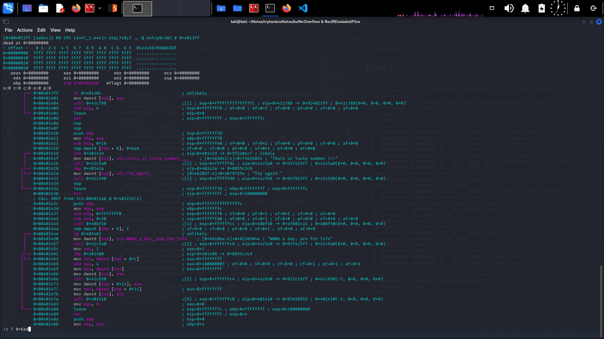
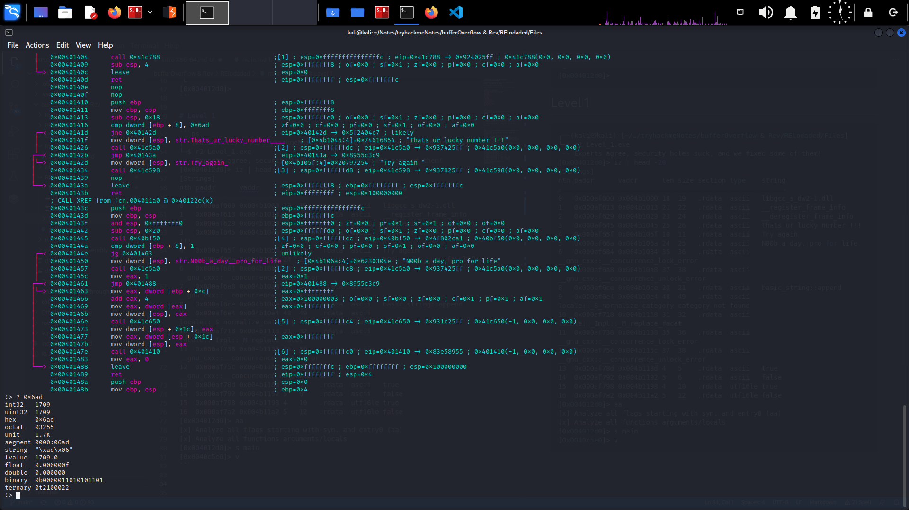

# Level 0
[write up](https://gist.github.com/isira-adithya/8ab4a2d6374708418cef7c2b10b8de56)

Massive amount of string lines , need infinite amount of lines in terminal, or head 50 would have worked. 

strings Level.exe | grep -E '.{10,100}'

regular expression to search strings from 10-100 characters long.

```bash
┌──(kali㉿kali)-[~/Downloads]
└─$ strings Level.exe | grep -E '.{10,100}'
!This program cannot be run in DOS mode.
`@.eh_framP
|$Htv;\$Ds[
9|$Xv-9\$dv'
\$4;\$0tV+\$0
L$(f;D$,u{
"L$';T$Xvl
"L$$;T$Xvq
libgcc_s_dw2-1.dll
__register_frame_info
__deregister_frame_info
L3v3lZ340_is_D02e
That was easy....Bruh!!!
Dont Worry its a start ;)
Enter The Flag :: 

```

```ps
┌──(kali㉿kali)-[~/…/tryhackmeNotes/bufferOverflow & Rev/RElodaded/Files]
└─$ r2 Level_0.exe
 -- Don’t feed the bugs! (except delicious stacktraces)!
[0x004012d0]> iz | head -10
[Strings]
nth paddr      vaddr      len size section type    string
―――――――――――――――――――――――――――――――――――――――――――――――――――――――――
0   0x000af800 0x004b1000 18  19   .rdata  ascii   libgcc_s_dw2-1.dll
1   0x000af813 0x004b1013 21  22   .rdata  ascii   __register_frame_info
2   0x000af829 0x004b1029 23  24   .rdata  ascii   __deregister_frame_info
3   0x000af845 0x004b1045 17  18   .rdata  ascii   L3v3lZ340_is_D02e
4   0x000af857 0x004b1057 24  25   .rdata  ascii   That was easy....Bruh!!!
5   0x000af870 0x004b1070 25  26   .rdata  ascii   Dont Worry its a start ;)
6   0x000af88a 0x004b108a 18  19   .rdata  ascii   Enter The Flag :: 
^C
[0x004012d0]> 
```

# Level 1

```ps
┌──(kali㉿kali)-[~/…/tryhackmeNotes/bufferOverflow & Rev/RElodaded/Files]
└─$ r2 Level_1.exe
 -- Experts agree, security holes suck, and we fixed some of them!
[0x004012d0]> iz | head -20
[Strings]
nth paddr      vaddr      len size section type    string
―――――――――――――――――――――――――――――――――――――――――――――――――――――――――
0   0x000af600 0x004b1000 18  19   .rdata  ascii   libgcc_s_dw2-1.dll
1   0x000af613 0x004b1013 21  22   .rdata  ascii   __register_frame_info
2   0x000af629 0x004b1029 23  24   .rdata  ascii   __deregister_frame_info
3   0x000af645 0x004b1045 25  26   .rdata  ascii   Thats ur lucky number !!!
4   0x000af65f 0x004b105f 10  11   .rdata  ascii   Try again 
5   0x000af66a 0x004b106a 24  25   .rdata  ascii   N00b a day, pro for life
6   0x000af684 0x004b1084 35  36   .rdata  ascii   __gnu_cxx::__concurrence_lock_error
7   0x000af6a8 0x004b10a8 37  38   .rdata  ascii   __gnu_cxx::__concurrence_unlock_error
8   0x000af6ce 0x004b10ce 20  21   .rdata  ascii   basic_string::append
9   0x000af6e4 0x004b10e4 48  49   .rdata  ascii   locale::_S_normalize_category category not found
10  0x000af718 0x004b1118 31  32   .rdata  ascii   locale::_Impl::_M_replace_facet
11  0x000af738 0x004b1138 35  36   .rdata  ascii   __gnu_cxx::__concurrence_lock_error
12  0x000af75c 0x004b115c 37  38   .rdata  ascii   __gnu_cxx::__concurrence_unlock_error
13  0x000af78d 0x004b118d 4   5    .rdata  ascii   true
14  0x000af792 0x004b1192 5   6    .rdata  ascii   false
15  0x000af798 0x004b1198 4   10   .rdata  utf16le true
16  0x000af7a2 0x004b11a2 5   12   .rdata  utf16le false
[0x004012d0]> aa
[x] Analyze all flags starting with sym. and entry0 (aa)
[x] Analyze all functions arguments/locals
[0x004012d0]> s main
[0x0040c5e0]> v
```

[Found it](./screenshots/level_1.png)



[Let's get that number](./screenshots/Level_1a.png)



